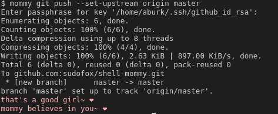

# sudofox/shell-mommy

Inspired by [Gankra/cargo-mommy](https://github.com/Gankra/cargo-mommy)

This is a shell script that provides a `mommy` function which emulates a nurturing and supportive figure. The `mommy` function can be used to offer praise and encouraging responses to a user's actions, depending on the exit status of the command that is passed to it.

By default, the text will be output in a light pink to stderr. You can change this to a light blue if you find that more encouraging.

</a>


I hope this will serve to improve the efficiency of your workflow and general mental health. Please use responsibly.

## Installation

To use the `mommy` function, you can source the `shell-mommy.sh` script in your current shell or add it to your `~/.bashrc` file to have it available every time you open a new terminal.

```
. /path/to/shell-mommy.sh
```

If you'd like it to always show a message after each command, you can define a custom `PROMPT_COMMAND` like so:

```
export PROMPT_COMMAND="mommy \\$\\(exit \$?\\); $PROMPT_COMMAND"
```

if that doesn't work for you, try:
```
export PS1="\$(mommy \$\(exit \$?\))$PS1"
```

## Configuration

The `mommy` function has several customizable options that can be set using environment variables:

- `SHELL_MOMMYS_LITTLE`: Sets the affectionate term that `mommy` will use to refer to the user. The default value is "girl".
- `SHELL_MOMMYS_PRONOUNS`: Sets the pronouns that `mommy` will use to refer to itself. The default value is "her".
- `SHELL_MOMMYS_ROLES`: Sets the role that `mommy` will have. The default value is "mommy".
- `SHELL_MOMMYS_COLOR`: Sets the color of the text output by `mommy`. The default value is a light pink color.
- `SHELL_MOMMYS_ONLY_NEGATIVE`: If set to `true`, `mommy` will provide encouragement (on non-zero exit status) but not praise. This will keep clutter down if you intend to use `mommy` as a `PROMPT_COMMAND`.
- `SHELL_MOMMYS_NEGATIVE_RESPONSES`/`SHELL_MOMMYS_POSITIVE_RESPONSES`: Sets the possible responses that `mommy` will use. This should be in the form of a bash array and will override the default responses. Want Samuel L. Jackson to chastise or compliment you? [Now you can!](https://github.com/sudofox/shell-mommy/issues/5#issuecomment-1381029744)

To add multiple possible values, separate them with a forward slash, for example:

```sh
export SHELL_MOMMYS_LITTLE="child/girl/boy"
# ...
$ mommy ls
README.md  shell-mommy.sh
awe, what a good boy~
mommy knew you could do it~ ❤️
$ mommy ls
README.md  shell-mommy.sh
good girl~
mommy's so proud of you~ ❤️
$ mommy ls
README.md  shell-mommy.sh
mommy thinks her little child earned a big hug~ ❤️
```

## Usage

To use the `mommy` function, simply pass a command as an argument and `mommy` will provide a supportive response based on the exit status of the command. Depending on the exit status, `mommy` will provide a response of praise or encouragement.

```sh
mommy ls
# Output: Good girl! mommy's so proud of you! ❤️

mommy this-command-does-not-exist
# Output: Just a little further, sweetie~ ❤️
```

## Example

```
# Set custom affectionate term and pronouns
export SHELL_MOMMYS_LITTLE="kiddo"
export SHELL_MOMMYS_PRONOUNS="them"

# Use the mommy function to run a command
mommy ls

# Output:
# That's a good kiddo~ ❤️
```
